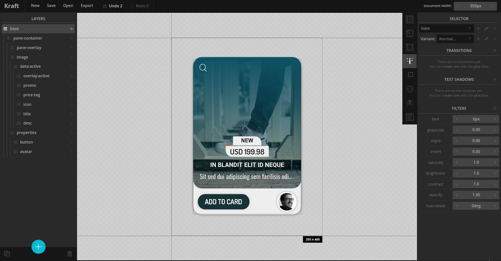

# kraft.ui
[](https://app.fossa.com/projects/git%2Bgithub.com%2Floouislow81%2Fkraft.ui?ref=badge_shield)


<p align="left">
  
</p>

A professional UI prototyping tool for the high-fidelity frontend web and mobile development. UI components can be very modular.

<p align="left">
  
  
  
  
</p>

### _download

Download the [Community Edition](https://github.com/loouislow81/kraft.ui/releases/tag/4.6.22) binary for Linux.

### _prerequisites

`Kraft` requires `NodeJS` runtime to be installed,

```bash
$ sudo apt install -y nodejs
$ sudo npm i -g n
$ sudo n latest
```

### _run

```bash
$ npm i
$ npm start
```

---

[MIT](https://github.com/loouislow81/kraft.ui/blob/master/LICENSE)


## License
[](https://app.fossa.com/projects/git%2Bgithub.com%2Floouislow81%2Fkraft.ui?ref=badge_large)